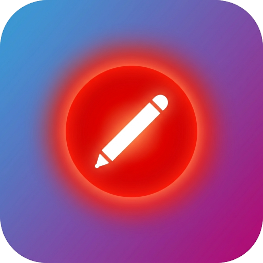
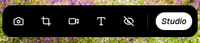
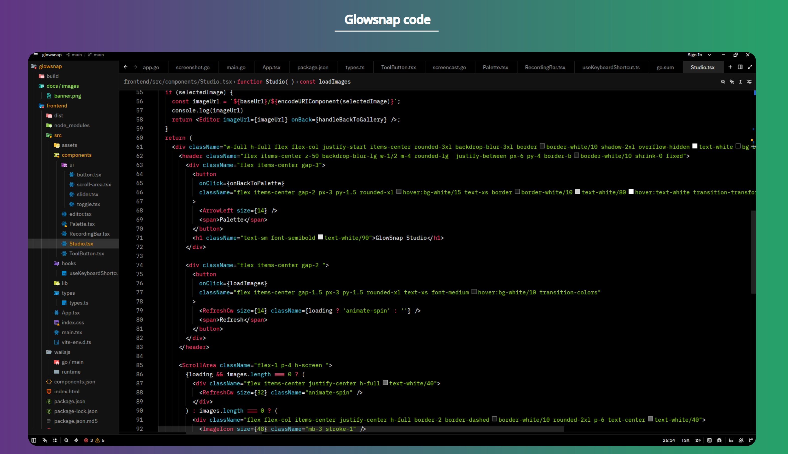
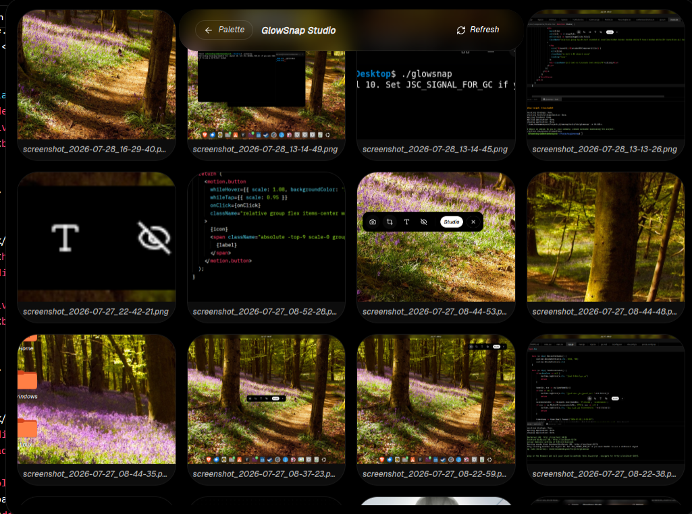
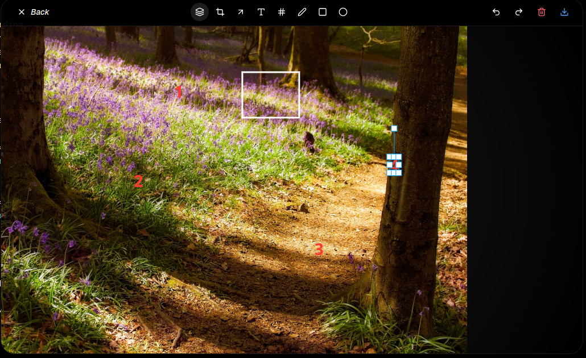

#  GlowSnap


<p align="center">
  
</p>

<p align="center">
  <b>A modern open-source screenshot and visual editing tool for Linux.</b>
  <br>
  Capture, customize, and transform your screenshots into beautiful visuals with a simple and elegant workflow.
</p>

<p align="center">
  
  
  
</p>

<p align="center">
  
</p>


##  About

GlowSnap is an open-source Linux productivity tool designed to make screenshots more powerful and beautiful.

It helps you capture your screen, organize your screenshots, and turn them into polished visuals with modern editing tools, customizable styles, and a clean user experience.

Built with simplicity and performance in mind, GlowSnap aims to bring a premium screenshot workflow to Linux.


Turn raw code and screenshots into polished, professional assets in one click. Perfect for content creators, developers, and testers on Linux.
<p align="center">
  
</p>


##  Features

### Screenshot Studio
-  Full screen screenshots
-  Area selection capture
-  Screenshot gallery
-  Full-screen image viewer

### Visual Editor
-  Free drawing
-  Arrows and shapes
-  Text editing
-  Custom colors and opacity
-  Crop tools

---

##  Screenshots

<p align="center">
  
</p>

<p align="center">
  
</p>

---

## Installation

### Linux

GlowSnap is currently in active development.

A Flatpak release is coming soon:

```
Coming soon on Flathub
```

---

## Built With

- **Go** — Backend and native system integration
- **Wails** — Desktop application framework
- **React + TypeScript** — User interface
- **Tailwind CSS** — Styling
- **shadcn/ui** — UI components
- **Konva** — Canvas-based editing

---

## Roadmap

### v1.1.0
- [ ] Add screencast
- [ ] Add settings
- [ ] Add blur effect to the editor

### v1.1.1
- [ ] Add more fonts

### Future
- Screenshot
- Advanced image editor
- Productivity tools ecosystem
- More native Linux integrations

---

##  Contributing

Contributions are welcome!

Whether you are a developer, designer, tester, or Linux enthusiast, you can help improve GlowSnap.

Check out our contribution guide:

```
CONTRIBUTING.md
```

---

##  License

GlowSnap is licensed under the MIT License.

You are free to use, modify, and distribute this software.

---

##  Vision

GlowSnap is not only a screenshot tool.

The goal is to build a collection of beautiful, simple, and open-source productivity tools designed specifically for Linux users.
